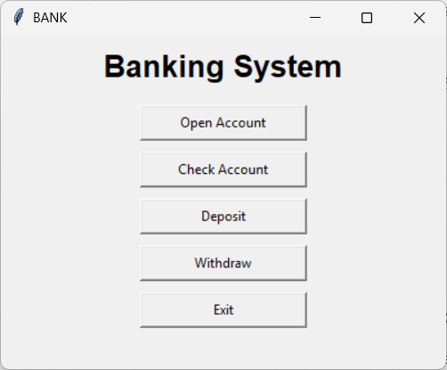
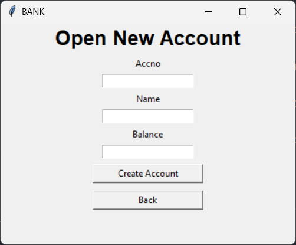
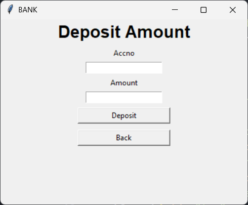
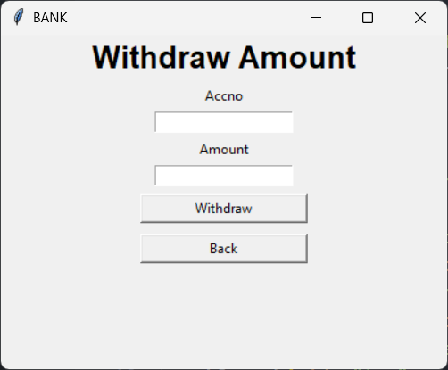

# Banking System (Tkinter & SQLite)

This is a simple **Banking System** application built using **Python, Tkinter (GUI), and SQLite (Database)**. The application allows users to:
- Open a new bank account
- Check account details
- Deposit money
- Withdraw money

## Features
- User-friendly GUI created with Tkinter
- Secure and lightweight SQLite database for storing account details
- Basic banking operations: Open Account, Check Account, Deposit, Withdraw
- Error handling for invalid inputs

## Technologies Used
- **Python** (for backend logic)
- **Tkinter** (for GUI)
- **SQLite** (for database management)

## Project Structure
```
Banking-System/
│-- banking.py          # Main application script
|-- database.py
│-- bank.db             # SQLite database file
│-- README.md           # Project documentation
```

## Installation

1. Clone this repository:
   ```sh
   git clone https://github.com/ccitworld/banking-system.git
   cd banking-system
   ```

2. Install required dependencies:
   *(SQLite and Tkinter is included with Python by default, so no additional installation is needed.)*

## Steps to Run

1. Run the Python script:
   ```sh
   python banking.py
   ```

2. The GUI will open with options to **Open Account, Check Account, Deposit, Withdraw, and Exit.**

3. Follow the prompts to perform banking operations.

## Screenshots
### Main Screen


### Open Account


### Deposit


### Withdraw


## Database Structure
The application uses an SQLite database (`bank.db`) with a table named `accounts`. The table structure is as follows:

| Column Name | Data Type | Description |
|------------|-----------|-------------|
| accno | INTEGER PRIMARY KEY | account ID  |
| name | TEXT | Account holder's name |
| balance | INTEGER | Account balance |

## Future Improvements
- Implement authentication with a PIN or password
- Add transaction history tracking
- Improve GUI design with additional styling

## License
This project is licensed under the MIT License.

## Author
Your Name - [GitHub Profile](https://github.com/yourusername)

